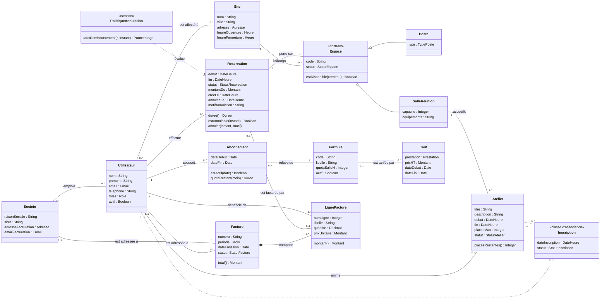

# Diagramme de classes métier — CoWork'In

> Atelier 1.4. Source versionnable : [`classes-metier.puml`](classes-metier.puml). Quatorze classes, huit énumérations, aucun identifiant technique, aucune clé étrangère : c'est le niveau conceptuel. Les `id` arrivent au MLD.

## 1. Vue d'ensemble

Rendu simplifié pour lecture directe sur GitHub (la classe d'association `Inscription` et les contraintes `{xor}` sont fidèlement rendues dans le source PlantUML) :

## 2. Glossaire métier (section 5.1 du document de conception)

Un mot, un concept. Le glossaire tranche les synonymes du verbatim.

| Terme retenu | Définition | Ne pas confondre avec |
|--------------|------------|-----------------------|
| **Site** | Un bâtiment de coworking (Lille, Roubaix, Tourcoing), avec ses horaires d'ouverture | *Espace* (une unité à l'intérieur du site) |
| **Espace** | Unité réservable : un poste ou une salle. Notion abstraite, jamais instanciée seule | *Site* |
| **Poste** | Espace individuel de travail, *flex* (libre) ou *dédié* (rattaché à une formule Résident) | *Bureau* (mot du langage courant, non retenu) |
| **Salle de réunion** | Espace collectif avec une capacité et des équipements ; seul espace soumis au quota | *Atelier* (un événement qui se tient dans une salle) |
| **Utilisateur** | Personne physique titulaire d'un compte ; porte un ou plusieurs **rôles** | *Coworker* (le rôle le plus courant d'un utilisateur), *Compte* (même chose vue de l'écran de connexion), *Client* (ambigu : celui qui paie) |
| **Rôle** | Ce qu'un utilisateur a le droit de faire : coworker, référent société, hôte d'accueil, gérant, animateur | *Acteur* (le rôle vu depuis le DCU) |
| **Société** | Personne morale cliente, destinataire d'une facture globale ; emploie des utilisateurs | *Référent société* (l'utilisateur qui la représente) |
| **Formule** | Offre du catalogue : Nomade, Résident, Team ; définit le quota de salle | *Abonnement* (la souscription d'un utilisateur à une formule) |
| **Abonnement** | Souscription d'un utilisateur à une formule sur une période bornée | *Formule* |
| **Tarif** | Prix HT d'une prestation (abonnement mensuel, poste à l'heure, poste à la journée, salle à l'heure) sur une période de validité | *Montant dû* (le prix appliqué, figé dans la réservation) |
| **Quota** | Heures de salle incluses par mois calendaire dans un abonnement (4 h) ; ne se reporte pas (H7) | *Solde*, *crédit* |
| **Créneau** | Intervalle début–fin d'une réservation, à l'heure ou à la journée | *Horaire d'ouverture* (du site) |
| **Réservation** | Occupation exclusive d'un espace par un utilisateur sur un créneau, avec un statut et un montant dû figé | *Inscription* (à un atelier, sans exclusivité d'espace) |
| **Montant dû** | Ce que la réservation coûte à l'utilisateur, calculé et figé à la confirmation : 0 pour un abonné dans son quota | *Tarif* |
| **Atelier** | Événement animé, dans une salle, à une date, avec une jauge | *Salle* |
| **Inscription** | Participation d'un utilisateur à un atelier ; porte une date et un statut | *Réservation* |
| **Facture** | Document mensuel, immuable une fois émis, adressé à un utilisateur **ou** à une société | *Ligne de facture* |
| **Ligne de facture** | Une prestation facturée, avec libellé et prix unitaire recopiés, rattachée à un bénéficiaire (le collaborateur) | — |
| **Présent** | Utilisateur ayant une réservation confirmée en cours sur un site (H3) | *Inscrit* (à un atelier) |
| **Taux d'occupation** | Heures réservées confirmées rapportées aux heures ouvrables × nombre d'espaces, par site et par période | — |

## 3. Justification des choix structurants (section 5.3)

### 3.1 Pourquoi `Reservation` est une classe et non une classe d'association

Une classe d'association entre `Utilisateur` et `Espace` ne tolère **qu'un seul lien par couple**. Or le même coworker réserve la même salle tous les mardis : le couple (utilisateur, espace) se répète autant de fois qu'il y a de créneaux. Il faut donc une classe à part entière, avec sa propre identité, son cycle de vie (`EN_ATTENTE` → `CONFIRMEE` → `ANNULEE`) et ses opérations (`annuler`, `estAnnulable`). C'est la limite énoncée dans le cours, appliquée.

À l'inverse, `Inscription` **reste** une classe d'association : un utilisateur ne s'inscrit qu'une fois à un atelier donné (RG-18). S'il annule puis se réinscrit, c'est la même inscription qui change de statut et de date. Cette limite est acceptée et documentée : si un jour un atelier se répète en sessions, `Inscription` devra devenir une classe ordinaire.

### 3.2 Pourquoi `Espace` est abstraite

Un poste et une salle partagent tout ce qui compte pour la réservation : un code, un site, un statut, la règle de non-chevauchement (RG-04), la mise en maintenance (RG-14). Seule la salle porte une capacité et des équipements et compte dans le quota. Test du cours : *un objet peut-il changer de sous-classe au cours de sa vie ?* Non — un poste ne devient jamais une salle. L'héritage est donc stable et légitime. `Espace` est abstraite parce qu'aucun espace n'existe « en général » : on réserve toujours un poste ou une salle. En base, cela deviendra une table unique avec discriminant (voir MLD).

### 3.3 Pourquoi `Abonnement` est distinct de `Formule`

`Formule` est le catalogue : trois lignes (Nomade, Résident, Team) qui changent rarement. `Abonnement` est la souscription d'une personne, bornée dans le temps : un coworker passe de Nomade à Résident en mars, une société résilie en juin. Si l'on mettait `codeFormule` directement dans `Utilisateur`, on perdrait l'historique (quelle formule en janvier pour la facture de janvier ?) et l'on ne pourrait pas gérer une souscription future. C'est le cas d'historisation n° 2 du cours : *un coworker change de formule → entité avec ses bornes, et non une clé étrangère sur l'utilisateur*.

### 3.4 Pourquoi `Tarif` est une classe séparée

Le prix d'une formule ou d'une heure de salle change en janvier. Question posée au client (méthode du cours) : *faut-il connaître la valeur à une date donnée ?* Oui, pour recalculer une facture contestée. D'où `Tarif` avec `dateDebut` / `dateFin`, relié optionnellement à `Formule` (uniquement pour la prestation `ABONNEMENT_MENSUEL`). La réservation fige son `montantDu` au moment de la confirmation, et la ligne de facture recopie le prix unitaire : ce sont trois informations différentes (prix courant, prix appliqué, prix facturé), pas une redondance.

### 3.5 Pourquoi `roles` est un attribut multivalué ici, et une table au MLD

Au niveau conceptuel, dire qu'un utilisateur *a* des rôles est la formulation la plus lisible. UML tolère `[1..*]`. MERISE, lui, interdit les propriétés multivaluées : au MCD, `ROLE` deviendra une entité reliée par une relation `EXERCER`, et au MLD une table de jonction. C'est la 1FN appliquée dès la conception, pas rattrapée après.

### 3.6 Ce qu'on a refusé

- **Un attribut `quotaConsomme` sur `Abonnement`.** Il est calculable (somme des heures de salle confirmées du mois). Le stocker créerait deux vérités à maintenir à chaque réservation et annulation. `quotaRestant(mois)` est une opération, pas une donnée.
- **Un héritage `ClientParticulier` / `ClientSociete`.** Un coworker qui rejoint une société changerait de classe : impossible proprement. On a une association optionnelle vers `Societe`.
- **Un attribut `nbInscrits` sur `Atelier`.** Même raison que le quota : `placesRestantes()` se calcule. Dénormalisation refusée en V1, réexaminable sur mesure de performance (voir `mld.md`).

## 4. Opérations issues des diagrammes de séquence (atelier 2.2)

Une opération ne s'invente pas : elle est justifiée par un message d'un diagramme de séquence.

| Opération | Justifiée par | Diagramme |
|-----------|---------------|-----------|
| `Espace.estDisponible(creneau)` | message *vérifier la disponibilité* | séquence système UC-02 (cours) |
| `Abonnement.quotaRestant(mois)` | message *décompter le quota mensuel* et recrédit à l'annulation | séquences UC-02 et UC-04 |
| `Abonnement.estActif(date)` | branche `alt [abonnement actif]` du calcul de montant | séquence système UC-01 (fiche, étape 5) |
| `Reservation.estAnnulable(instant)` | garde du fragment `break [réservation déjà commencée]` | séquence système UC-04 |
| `Reservation.annuler(instant, motif)` | message *passer la réservation à ANNULEE* | séquence détaillée UC-04 |
| `PolitiqueAnnulation.tauxRemboursement(r, instant)` | fragment `alt` total / partiel / aucun | séquences UC-04 |
| `Reservation.duree()` | calcul du montant et du quota | séquence détaillée UC-02 (cours) |
| `Atelier.placesRestantes()` | affichage et contrôle de la jauge | fiche UC-03, étapes 2 et 4 |
| `Facture.total()`, `LigneFacture.montant()` | édition des factures | UC-08 |
