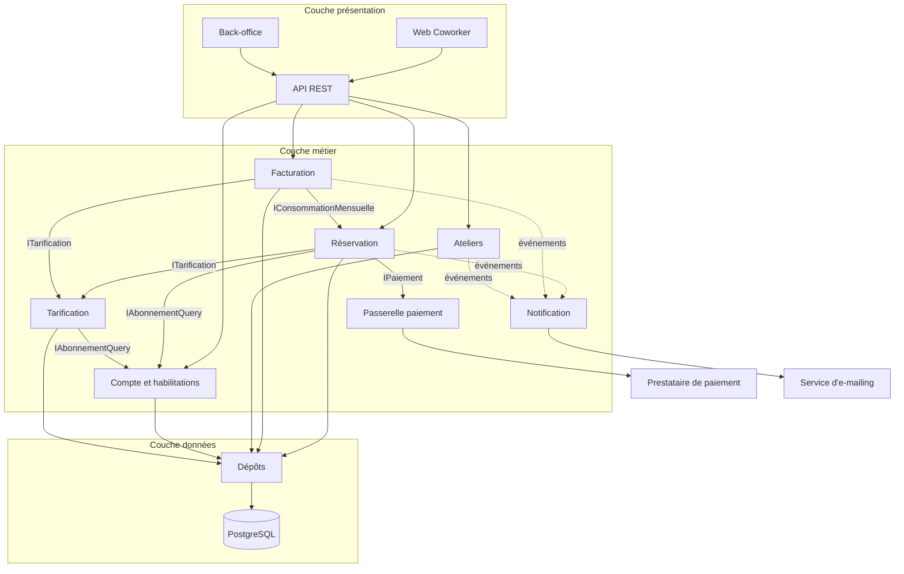

# Fiche de synthèse de conception applicative — CoWork'In

> Livrable de la séquence J1·2, gabarit du cours en huit sections. Diagramme de composants : [`composants.puml`](composants.puml).

## 1. Scénarios modélisés

| Scénario | Diagrammes | Pourquoi celui-là (critère : risque) |
|----------|------------|--------------------------------------|
| UC-02 Réserver une salle | séquence système et détaillée du cours, reprises comme référence | Concurrence sur un créneau (la plainte n° 1 du client), calcul de quota, appel au PSP |
| UC-04 Annuler une réservation | [`sequence-systeme.puml`](sequence-systeme.puml), [`sequence-detaillee.puml`](sequence-detaillee.puml) | Argent restitué selon trois règles, système externe pouvant échouer, idempotence |
| UC-03 S'inscrire à un atelier | pas de séquence : la fiche suffit | Un seul point dur, la dernière place — traité par un verrou et un trigger, décrit dans la fiche et le MPD |
| UC-08 Éditer les factures | pas de séquence en V1 | Traitement par lots, sans interaction ; un diagramme d'activité serait plus adapté — dette documentée en section 8 |

## 2. Opérations système identifiées (contrat de l'API)

| Opération | Acteur | Entrées | Sorties | UC |
|-----------|--------|---------|---------|----|
| `rechercherDisponibilites` | A1, A3 | site, début, fin, type d'espace, capacité min. | espaces disponibles, statut en texte | UC-05 |
| `confirmerReservation` | A1, A3 | espace, début, fin, bénéficiaire (si hôte) | réservation, montant dû, quota restant | UC-01, UC-02 |
| `reglerMontant` | A1 | réservation `EN_ATTENTE`, jeton PSP | réservation `CONFIRMEE` ou `ANNULEE`, cause | UC-15 |
| `simulerAnnulation` | A1, A3, A4 | réservation | taux, montants remboursé / conservé, heures recréditées | UC-04 |
| `annulerReservation` | A1, A3, A4 | réservation, motif | statut, référence ou état de la file de remboursement | UC-04 |
| `inscrireAtelier`, `annulerInscription` | A1 | atelier | inscription, places restantes | UC-03 |
| `publierAtelier`, `listerInscrits` | A5 | atelier (titre, dates, salle, jauge) | atelier publié ; liste nominative de **ses** inscrits | UC-11, UC-12 |
| `mettreEnMaintenance`, `leverMaintenance` | A3, A4 | espace, période, motif | réservations confirmées à traiter | UC-07 |
| `listerPresents` | A3, A4 | site, instant | utilisateurs présents, espace, fin de créneau | UC-06 |
| `cloturerFacturation` | A8, A4 | période | factures émises, anomalies (utilisateur sans destinataire…) | UC-08 |
| `tauxOccupation` | A4 | site, période | taux par jour et par type d'espace | UC-09 |
| `creerCompte`, `rattacherCollaborateur`, `detacherCollaborateur` | A1, A2 | identité ; utilisateur × société | compte actif ; rattachement | UC-13, UC-10 |
| `consulterConsommation`, `consulterFactures` | A1, A2, A4 | période, portée | heures, montants, factures PDF | UC-14 |

## 3. Découpage retenu

### 3.1 Couches et responsabilités

| Couche | Responsabilité | Connaît | Ne connaît pas |
|--------|----------------|---------|----------------|
| **Présentation** | Traduire une intention utilisateur en appel métier, mettre en forme la réponse, authentifier, valider le *format* | HTTP, HTML/JSON, session, DTO | Les règles de gestion, SQL |
| **Métier** | Règles de gestion, autorisation sur l'objet, orchestration, frontières de transaction | Les entités, les politiques, les ports | HTTP, SQL, le nom du PSP |
| **Données** | Persister et retrouver, transactions, mapping | PostgreSQL, requêtes, index | Les règles métier |

### 3.2 Composants et interfaces

| Composant | Couche | Fournit | Requiert |
|-----------|--------|---------|----------|
| Web Coworker, Back-office | Présentation | — | API REST |
| API REST | Présentation | endpoints | `IReservation`, `IHabilitation`, Ateliers, Facturation |
| **Réservation** | Métier | `IReservation`, `IConsommationMensuelle` | `ITarification`, `IAbonnementQuery`, `IPaiement`, `IEvenements`, dépôts |
| **Tarification** | Métier | `ITarification` | `IAbonnementQuery`, dépôts (tarifs) |
| **Facturation** | Métier | — | `IConsommationMensuelle`, `ITarification`, `IEvenements`, dépôts |
| **Ateliers** | Métier | — | `IEvenements`, dépôts |
| **Compte & habilitations** | Métier | `IAbonnementQuery`, `IHabilitation` | dépôts |
| **Notification** | Métier | `IEvenements` (écoute) | Service d'e-mailing (A7) |
| **Passerelle paiement** | Métier (adaptateur) | `IPaiement` | Prestataire de paiement (A6) |
| Dépôts | Données | interfaces définies par le métier | PostgreSQL |

### 3.3 Diagramme de composants

Voir [`composants.puml`](composants.puml). Rendu simplifié :

Aucune flèche ne remonte : c'est le critère de validité du découpage.

## 4. Justification du découpage

Écrit pour un architecte sceptique.

- **On sépare la présentation du métier** parce que le même cas d'usage a déjà trois points d'entrée (site coworker, back-office, tâche planifiée pour l'expiration). Une règle dans un contrôleur serait dupliquée dès le deuxième. Entre les deux passent des DTO : le modèle métier n'est pas le contrat public de l'API.
- **On sépare Réservation de Tarification** *bien que la tarification ne semble appelée que par la réservation* : elle est aussi appelée par la **Facturation** pour la ligne d'abonnement mensuel, et elle change au rythme de la politique commerciale (nouveau tarif en janvier, nouvelle formule), pas au rythme des règles de disponibilité. Deux clients, deux rythmes de changement : un composant. Si l'un des deux arguments tombait, on fusionnerait.
- **On sépare Réservation de Facturation** parce que la facturation est un traitement par lots, mensuel, aux exigences comptables (numérotation, immuabilité), quand la réservation est transactionnelle et interactive. Elles partagent une donnée (les consommations du mois) : d'où l'interface `IConsommationMensuelle`, et rien d'autre.
- **On sépare Compte & habilitations** parce que l'autorisation (« cet hôte est-il affecté à ce site ? ») est requise par tous les autres composants. Un composant transverse évite que chacun réinvente la portée.
- **On isole la Passerelle paiement derrière un port** parce que le fournisseur est un choix commercial révocable. `IPaiement` appartient au métier ; l'adaptateur appartient au fournisseur du jour.
- **On sépare le métier des données par des interfaces définies par le métier** parce que c'est le seul moyen de tester la RG-04 ou la politique d'annulation sans base. La couche données dépend du métier, jamais l'inverse.

## 5. Points de couplage identifiés

| # | Point de couplage | Risque | Décision |
|---|-------------------|--------|----------|
| P1 | `Facturation` relit les réservations du mois dans `ReservationRepository` | Couplage par la base : la facturation dépend du schéma interne des réservations ; un renommage de colonne casse la clôture du 1er | **Corrigé** — interface de lecture `IConsommationMensuelle` exposée par Réservation, qui rend des consommations (bénéficiaire, prestation, quantité, montant figé). Rejeté : une vue en base (couplage toujours par la base, invisible dans le code) ; rejeté : des événements de consommation accumulés (la facturation doit pouvoir **recalculer** un mois contesté, ce que des événements consommés ne permettent pas simplement) |
| P2 | `Réservation` appelle directement le SDK du PSP | Dépendance à un fournisseur dans le cœur métier ; impossible à tester sans compte PSP | **Corrigé** — port `IPaiement` défini par le métier, adaptateur dans la Passerelle paiement, doublure en test |
| P3 | Envoi d'e-mail synchrone à la fin de chaque cas d'usage | Couplage temporel : si le service d'e-mailing ralentit, la réservation ralentit ; s'il tombe, la réservation échoue | **Corrigé** — événements `ReservationConfirmee`, `ReservationAnnulee`, `InscriptionConfirmee`, `FactureEmise` publiés sur `IEvenements` ; Notification les consomme. Prix accepté : traçabilité du flux via la file |
| P4 | Les contrôleurs exposent les entités métier | Le modèle interne devient le contrat public ; plus de refactoring possible sans casser les clients | **Corrigé** — DTO entre présentation et métier ; pas de DTO entre métier et données (la duplication y coûterait plus qu'elle ne rapporte) |
| P5 | `Tarification` et `Réservation` interrogent `Compte` pour savoir si l'utilisateur est abonné et avec quelle formule | Trois composants dépendent de Compte | **Assumé** — dépendance intentionnelle, en lecture, via `IAbonnementQuery`. Compte est le composant transverse par nature ; le couplage est nommé et unidirectionnel |
| P6 | La RG-04 (non-chevauchement) existe deux fois : dans `Réservation` (message d'erreur) et dans PostgreSQL (contrainte d'exclusion) | Duplication d'une règle | **Assumé volontairement** — ce n'est pas une incohérence mais une défense en profondeur : la base **garantit**, le métier **explique**. Documenté dans le MPD |

## 6. Décisions techniques structurantes

| Sujet | Décision |
|-------|----------|
| **Transactions** | Vérification de disponibilité et insertion de la réservation dans la **même** transaction ; la garantie finale est la contrainte d'exclusion `ex_reservation_pas_de_chevauchement`. Niveau d'isolation `READ COMMITTED` suffisant grâce à la contrainte |
| **Concurrence sur la dernière place d'un atelier** | `SELECT … FOR UPDATE` sur la ligne `atelier` puis contrôle par trigger `tg_inscription_places_restantes` : deux inscriptions simultanées se sérialisent |
| **Paiement et point de non-retour** | Réservation créée `EN_ATTENTE` **avant** l'appel au PSP ; passage à `CONFIRMEE` après autorisation. Échec après autorisation → annulation d'autorisation (compensation). Jamais de débit sans réservation |
| **Idempotence** | Annulation idempotente par l'état de la réservation ; règlement idempotent par clé d'idempotence transmise au PSP (référence de réservation) |
| **Expiration** | Le planificateur (A8) annule les réservations `EN_ATTENTE` de plus de 15 min (prolongées une fois au plus) et rejoue les remboursements `EN_ERREUR` |
| **Calculs dérivés** | Quota consommé, places restantes, total de facture : **calculés**, jamais stockés (voir refus de dénormalisation dans `mld.md`) |
| **Identifiants** | `BIGINT GENERATED ALWAYS AS IDENTITY` en base ; les identifiants exposés dans les URL publiques (réservation, facture) sont des UUID pour ne pas être devinables |

## 7. Exigences transverses

### Sécurité, par couche

| Couche | Responsabilité |
|--------|----------------|
| Présentation | Authentification, session, CSRF, en-têtes de sécurité, validation de **format** |
| Métier | **Autorisation sur l'objet** (ce coworker peut-il annuler *cette* réservation ? cet hôte est-il affecté à *ce* site ?), validation de **règle** ; jamais dans le seul contrôleur |
| Données | Requêtes paramétrées, compte applicatif à moindre privilège (pas de `DROP`), contraintes d'intégrité comme dernier rempart, chiffrement au repos |
| Transverse | Journalisation des consultations de la liste des présents (donnée de localisation indirecte), des annulations par l'exploitant et des accès aux factures ; secrets hors du code ; durées de conservation dans `mpd.md` |

### Accessibilité, ce que l'architecture doit permettre

- **Rendu côté serveur possible** pour les parcours critiques (recherche, réservation, annulation) : pas d'application 100 % cliente sans repli.
- **Messages d'erreur métier remontés tels quels** : les exceptions `ConflitCreneau`, `QuotaDepasse`, `ReservationNonAnnulable` portent une cause et une action ; la présentation ne les écrase pas en « une erreur est survenue ».
- **États explicites dans le modèle** : `DISPONIBLE / MAINTENANCE / RETIRE`, `CONFIRMEE / ANNULEE`, `complet` sont des valeurs métier, donc libellables en texte et en `aria-label`, jamais de simples couleurs calculées en front.
- **Pas de délai imposé par l'infrastructure** : l'expiration à 15 min est une règle métier prolongeable, pas un timeout de session.

## 8. Risques et dettes acceptées

| Risque ou dette | Pourquoi on l'accepte | Quand on le revoit |
|-----------------|------------------------|--------------------|
| Hypothèses H1 à H7 non validées par le client | Elles sont isolées (politique d'annulation, présence = réservation en cours, destinataire des factures) | À la première réunion client ; les trois prioritaires sont Q2, Q3, Q5 |
| Pas de liste d'attente pour les ateliers | Volume faible ; le modèle l'accepte (statut `LISTE_ATTENTE`) | Si le client le demande |
| Présence déduite des réservations, pas de pointage physique | Hors périmètre V1 ; la badgeuse deviendrait un acteur secondaire | À l'arrivée d'un contrôle d'accès |
| Pas de diagramme d'activité pour la clôture de facturation | Traitement par lots simple en V1 (une facture par destinataire, lignes depuis `IConsommationMensuelle`) | Dès qu'apparaissent des avoirs ou des factures partielles |
| Monolithe modulaire, pas de microservices | Trois sites, quelques milliers de réservations par mois : les frontières sont dans le code, pas dans le réseau | Jamais, sauf changement d'échelle mesuré |
| Aucune dénormalisation (`nb_inscrits`, `quota_consomme`, `total_facture`) | Aucune mesure de performance ne la justifie | Sur plan d'exécution et temps de réponse mesurés, après index et cache |
| L'objet `Remboursement` est apparu à la séquence détaillée, pas à l'analyse | C'est un objet technique de suivi, pas un concept du client | Il est dans le MLD et tracé dans la matrice comme « table technique légitime » |
