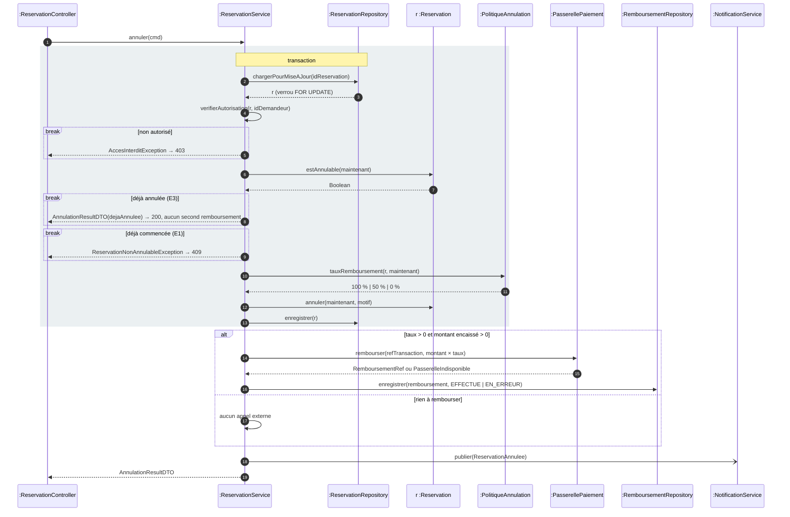

# Séquence détaillée — UC-04 Annuler une réservation

> Atelier 2.2. Source : [`sequence-detaillee.puml`](sequence-detaillee.puml). Boîte blanche : on ouvre le système et on répartit les responsabilités entre contrôleur, service, entité, politique, dépôt et port. Ce diagramme a une durée de vie courte ; il documente la conception au moment T.

## 1. Le scénario en Mermaid

## 2. Répartition des responsabilités

| Participant | Couche | Ce qu'il sait | Ce qu'il ignore |
|-------------|--------|---------------|-----------------|
| `ReservationController` | Présentation | HTTP, codes de retour, DTO, format du motif | La règle des 24 h, l'existence du PSP |
| `ReservationService` | Métier | L'orchestration, l'autorisation sur l'objet, la frontière de transaction | SQL, HTTP |
| `Reservation` (entité) | Métier | Son propre état : peut-elle être annulée ? comment passe-t-elle à `ANNULEE` ? | Le remboursement, la notification |
| `PolitiqueAnnulation` | Métier | Les seuils et les taux (H2) | Tout le reste : elle reçoit une réservation et un instant, rend un pourcentage |
| `ReservationRepository` | Données | Charger avec verrou, enregistrer | Les règles métier |
| `PasserellePaiement` | Port (interface définie par le métier) | Le contrat `rembourser(ref, montant)` | Le fournisseur réel — l'adaptateur PSP l'implémente |
| `RemboursementRepository` | Données | Journaliser les demandes et leur statut | — |
| `NotificationService` | Métier, asynchrone | Transformer un événement en e-mail via A7 | Qui a publié l'événement |

Signal d'alarme vérifié : aucune ligne de vie ne reçoit dix messages quand les autres n'en reçoivent qu'un. Le service orchestre (six appels sortants), mais la décision d'annulabilité est dans l'entité et la décision financière dans la politique.

## 3. Opérations à ajouter au diagramme de classes

L'atelier en demandait trois ; la séquence en justifie cinq. Elles sont reportées dans [`classes-metier.puml`](classes-metier.puml).

| Opération | Message qui la justifie | Classe |
|-----------|-------------------------|--------|
| `estAnnulable(instant : DateHeure) : Boolean` | message 6 — garde des deux `break` | `Reservation` |
| `annuler(instant : DateHeure, motif : String)` | message 9 — changement d'état et horodatage | `Reservation` |
| `tauxRemboursement(r : Reservation, instant : DateHeure) : Pourcentage` | message 8 — décision total / partiel / aucun | `PolitiqueAnnulation` (nouvelle classe, stéréotype `«service»`) |
| `quotaRestant(mois : Mois) : Duree` | recrédit du quota après annulation (RG-07) : il n'y a rien à « recréditer » si le quota est calculé — la séquence confirme que le stocker aurait créé une mise à jour de plus | `Abonnement` |
| `duree() : Duree` | calcul du montant × taux | `Reservation` |

Le `RemboursementRepository` et l'objet `Remboursement` (référence PSP, montant, statut, horodatage) n'existaient pas au diagramme de classes : la séquence les a fait apparaître. `Remboursement` est un objet **technique de suivi**, pas une classe métier du domaine du client ; il ira au MLD comme table `remboursement`, rattachée à `reservation`.

## 4. Les trois décisions techniques

1. **Frontière de transaction.** Tout ce qui est dans le cadre `transaction` (chargement avec verrou, contrôles, changement d'état, enregistrement) est atomique. Le verrou `FOR UPDATE` sur la ligne de réservation ferme la fenêtre de concurrence entre `estAnnulable` et `enregistrer` : deux annulations simultanées se sérialisent, la seconde voit `ANNULEE` et répond sans effet.
2. **Le remboursement est hors transaction, et compensable.** Un appel réseau au PSP peut durer dix secondes ou échouer. On ne tient pas une transaction SQL ouverte pendant ce temps. Le remboursement est journalisé avec son statut ; `EN_ERREUR` est rejoué par le planificateur. La réservation est annulée dans tous les cas : le créneau doit redevenir disponible sans attendre le PSP.
3. **La notification est un événement.** `ReservationAnnulee` est publié ; le `NotificationService` écoute. Le service de réservation ne sait pas qui écoute (demain : un tableau de bord temps réel, un webhook vers la badgeuse). Prix accepté : la traçabilité du flux passe par la file d'événements.
