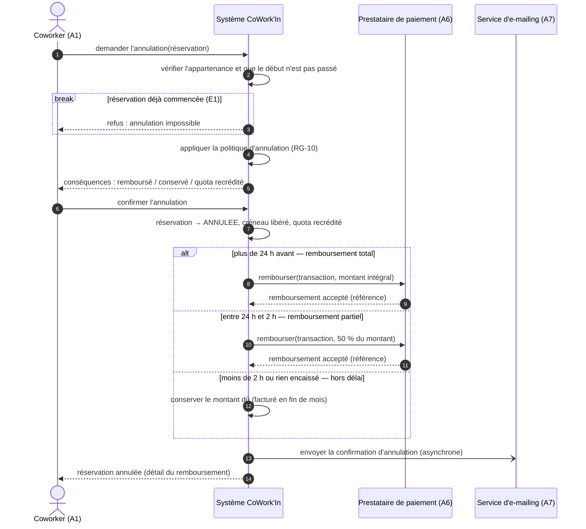

# Séquence système — UC-04 Annuler une réservation

> Atelier 2.1. Source : [`sequence-systeme.puml`](sequence-systeme.puml). Boîte noire : le système est un participant unique, le vocabulaire est celui du métier. Ce diagramme va dans le dossier et y reste ; il ne change que si le besoin change.

## 1. Le scénario en Mermaid

Lecture à voix haute, chaque message précédé de « puis » : *le coworker demande l'annulation, puis le système vérifie, puis il applique la politique, puis il annonce les conséquences, puis le coworker confirme, puis…* La phrase tient, le diagramme est bien nommé.

## 2. Pourquoi ce scénario

Il coche les trois critères du cours pour mériter un diagramme de séquence : il **traverse un système externe** (le prestataire de paiement), il **manipule de l'argent** avec trois issues différentes, et il possède une **règle d'échec subtile** (que se passe-t-il si la réservation a déjà commencé ? si le prestataire ne répond pas ? si on clique deux fois ?).

## 3. Ce que le diagramme produit : les opérations système

La liste des messages entrants est le contrat de l'API. Elle complète celles issues des fiches UC-01, UC-02, UC-03.

| Opération système | Acteur | Données entrantes | Données sortantes | UC |
|-------------------|--------|-------------------|-------------------|----|
| `simulerAnnulation` | Coworker, Hôte, Gérant | identifiant de réservation | taux de remboursement, montant remboursé, montant conservé, heures recréditées | UC-04 (étape 3) |
| `annulerReservation` | Coworker, Hôte, Gérant | identifiant de réservation, motif (obligatoire pour l'exploitant) | statut, référence de remboursement ou état de la file | UC-04 (étapes 4 à 7) |
| `rechercherDisponibilites` | Coworker, Hôte | site, début, fin, type d'espace, capacité minimale | espaces disponibles avec statut textuel | UC-05 |
| `confirmerReservation` | Coworker, Hôte | espace, début, fin, pour le compte de (hôte) | réservation, montant dû, quota restant | UC-01, UC-02 |
| `reglerMontant` | Coworker | réservation en attente, jeton de paiement | statut du paiement, réservation confirmée ou annulée | UC-15 |
| `inscrireAtelier` / `annulerInscription` | Coworker | atelier | inscription, places restantes | UC-03 |
| `listerPresents` | Hôte, Gérant | site, instant | utilisateurs présents et espace occupé | UC-06 |
| `mettreEnMaintenance` | Hôte, Gérant | espace, période, motif | réservations confirmées impactées à traiter | UC-07 |
| `cloturerFacturation` | Planificateur, Gérant | période (mois) | factures émises, anomalies | UC-08 |
| `tauxOccupation` | Gérant | site, période | taux par espace et par jour | UC-09 |

Deux opérations sortantes vers l'extérieur, à contractualiser : `rembourser(transaction, montant)` vers le prestataire de paiement ; `envoyer(message)` vers le service d'e-mailing (asynchrone).

## 4. Les trois décisions que la séquence rend inévitables

1. **Où vit la politique d'annulation ?** Les seuils 24 h / 2 h et les taux 100 % / 50 % / 0 % sont une hypothèse (H2). Ils sont isolés dans une classe `PolitiqueAnnulation` : quand le client répond à Q2, on change une classe, pas un diagramme.
2. **Où s'arrête la transaction ?** Le passage à `ANNULEE` et la libération du créneau sont **en base** dans une transaction. L'appel au prestataire est **en dehors** : un appel réseau ne se met pas dans une transaction SQL. La réservation est donc annulée d'abord, le remboursement est journalisé avec un statut (`DEMANDE`, `EFFECTUE`, `EN_ERREUR`) et rejoué en cas d'échec (E2).
3. **Que fait-on des doubles demandes ?** Deux onglets, deux clics : l'opération doit être **idempotente**. La deuxième demande trouve une réservation déjà `ANNULEE` et répond sans émettre de second remboursement (E3). C'est une règle qu'un diagramme de séquence rend visible et qu'un contrôleur seul aurait oubliée.
