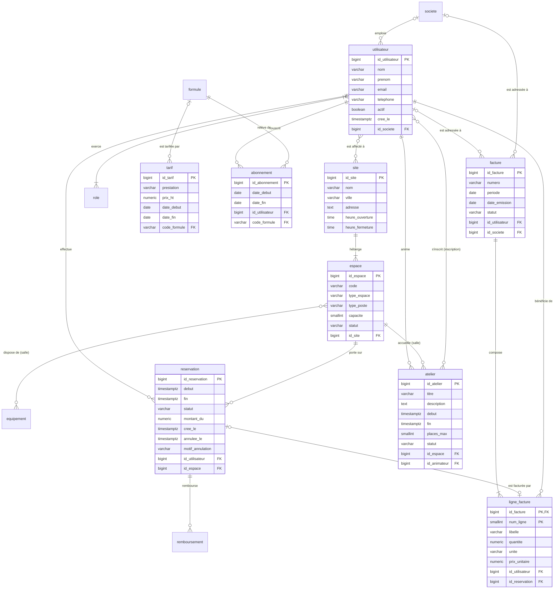

# Modèle logique de données (MLD) — CoWork'In

> Atelier 3.3 et 3.4. Dérivé du [MCD](mcd.md) **règle par règle** ; chaque table est annotée de la règle appliquée. Notation : `TABLE(clé primaire soulignée, colonne, #clé étrangère)`. Le MLD ajoute légitimement les identifiants techniques, les colonnes techniques (`cree_le`) et les tables de jonction — rien d'autre.

## 1. Le MLD annoté

### 1.1 Tables issues des entités (règle 1) et clés étrangères migrées (règle 2)

La clé étrangère va **du côté où la cardinalité maximale vaut 1** : « un espace n'a qu'un site, donc c'est `espace` qui porte `id_site` ».

```
site (id_site, nom, ville, adresse, heure_ouverture, heure_fermeture)
     -- R1

espace (id_espace, code, type_espace, type_poste, capacite, statut, #id_site)
     -- R1 ; héritage POSTE / SALLE_REUNION tranché en TABLE UNIQUE + discriminant type_espace
     -- R2 : HEBERGER (1,1) côté ESPACE → id_site NOT NULL
     -- prix à payer : CHECK « capacite renseignée ssi SALLE », « type_poste renseigné ssi POSTE »

equipement (code_equipement, libelle)
     -- R1, identifiant naturel

societe (id_societe, raison_sociale, siret, adresse_facturation, email_facturation)
     -- R1

utilisateur (id_utilisateur, nom, prenom, email, telephone, actif, cree_le, #id_societe)
     -- R1
     -- R2 : EMPLOYER (0,1) côté UTILISATEUR → id_societe NULL-able

role (code_role, libelle)
     -- R1, identifiant naturel

formule (code_formule, libelle, quota_salle_h, actif)
     -- R1, identifiant naturel

tarif (id_tarif, prestation, prix_ht, date_debut, date_fin, #code_formule)
     -- R1
     -- R2 : TARIFER (0,1) côté TARIF → code_formule NULL-able (renseigné ssi prestation = ABONNEMENT_MENSUEL)

abonnement (id_abonnement, date_debut, date_fin, #id_utilisateur, #code_formule)
     -- R1
     -- R2 ×2 : SOUSCRIRE (1,1) et RELEVER DE (1,1) côté ABONNEMENT → deux FK NOT NULL

reservation (id_reservation, debut, fin, statut, montant_du, cree_le, annulee_le, motif_annulation,
             #id_utilisateur, #id_espace)
     -- R1
     -- R2 ×2 : EFFECTUER (1,1) et PORTER SUR (1,1) côté RESERVATION

remboursement (id_remboursement, montant, statut, reference_psp, demande_le, effectue_le, #id_reservation)
     -- R1 ; table technique de suivi (justifiée par la séquence détaillée UC-04)
     -- R2 : REMBOURSER (1,1) côté REMBOURSEMENT

atelier (id_atelier, titre, description, debut, fin, places_max, statut, #id_espace, #id_animateur)
     -- R1
     -- R2 ×2 : ACCUEILLIR (1,1) → id_espace ; ANIMER (1,1) → id_animateur (référence utilisateur)
     -- « id_espace doit être une SALLE » et « id_animateur porte le rôle ANIMATEUR » : trigger au MPD

facture (id_facture, numero, periode, date_emission, statut, #id_utilisateur, #id_societe)
     -- R1
     -- R2 ×2 : ADRESSER A U (0,1) et ADRESSER A S (0,1) côté FACTURE → deux FK NULL-ables
     -- contrainte d'exclusion « exactement une des deux » → CHECK au MPD
```

### 1.2 Tables issues des relations (x,n)–(x,n) (règle 3)

Clé primaire composée des deux clés étrangères, plus les propriétés portées.

```
salle_equipement (#id_espace, #code_equipement)
     -- R3 : DISPOSER DE (0,n)–(0,n), sans propriété

utilisateur_role (#id_utilisateur, #code_role)
     -- R3 : EXERCER (1,n)–(0,n), sans propriété
     -- le (1,n) « au moins un rôle » n'est pas garantissable en SQL simple : applicatif + test

affectation (#id_utilisateur, #id_site)
     -- R3 : AFFECTER (0,n)–(0,n) — personnel d'accueil affecté à un ou plusieurs sites
     -- c'est la table qui donne son sens à la portée « site » de la matrice acteur × UC

inscription (#id_utilisateur, #id_atelier, date_inscription, statut)
     -- R3 : S'INSCRIRE (0,n)–(0,n), relation PORTEUSE
     -- la clé (id_utilisateur, id_atelier) garantit structurellement « une inscription par personne et par atelier » (RG-18)
```

### 1.3 Identification relative (règle 6) et relation (0,1)–(0,1) (règle 5)

```
ligne_facture (#id_facture, num_ligne, libelle, quantite, unite, prix_unitaire, #id_utilisateur, #id_reservation)
     -- R6 : COMPOSER, identification relative → clé primaire composite (id_facture, num_ligne), ON DELETE CASCADE
     -- R2 : BENEFICIER (1,1) côté LIGNE_FACTURE → id_utilisateur NOT NULL (le collaborateur bénéficiaire)
     -- R5 : FACTURER (0,1)–(0,1) → id_reservation NULL-able + UNIQUE (une réservation n'est facturée qu'une fois)
     -- libelle et prix_unitaire sont RECOPIÉS : historisation (RG-13), pas redondance
```

### 1.4 Contrôle de cohérence

| Compte | Détail |
|--------|--------|
| 14 entités | 14 tables |
| 4 relations (x,n)–(x,n) | 4 tables de jonction : `salle_equipement`, `utilisateur_role`, `affectation`, `inscription` |
| 15 relations (x,1)–(x,n) ou (0,1)–(0,1) | **0** table, 17 clés étrangères |
| **Total** | **18 tables** — cohérent avec **mon** MCD (le cours en compte 11 ou 12 sans rôles, équipements, remboursements et affectations ; l'écart est justifié table par table dans la matrice de traçabilité) |

## 2. Schéma relationnel en Mermaid



## 3. L'héritage ESPACE : arbitrage

| Stratégie | Pour | Contre | Décision |
|-----------|------|--------|----------|
| **Table unique + discriminant** | La requête la plus fréquente est « tous les espaces disponibles d'un site » ; une seule table pour la contrainte de non-chevauchement ; pas de jointure | Colonnes `NULL` selon le type : `capacite` et `type_poste` | **Retenue.** Le prix : deux `CHECK` (`ck_espace_capacite_si_salle`, `ck_espace_type_poste_si_poste`) |
| Une table par sous-type | Pas de `NULL` | La RG-04 devrait être posée deux fois ; « tous les espaces » devient un `UNION` | Rejetée |
| Table parent + tables filles | Propre conceptuellement | Jointure systématique pour deux colonnes spécifiques | Rejetée : surcoût sans bénéfice ici |

## 4. Normalisation — atelier 3.4

### 4.1 La table d'origine

Le tableur partagé actuel du client (celui du verbatim) a une feuille « Réservations » dont voici la structure reconstituée, telle qu'un export CSV la fournirait :

```
RESA_TABLEUR (Date, NomCoworker, EmailCoworker, Societe, Formule, TarifFormule,
              Espace, Site, VilleSite, Creneaux, Equipements, PrixTotal, Statut)
```

Exemple de ligne :

| Date | NomCoworker | EmailCoworker | Societe | Formule | TarifFormule | Espace | Site | VilleSite | Creneaux | Equipements | PrixTotal | Statut |
|------|-------------|---------------|---------|---------|--------------|--------|------|-----------|----------|-------------|-----------|--------|
| 10/03/2026 | Salma Benali | salma.benali@… | Nordwave | Team | 249 | S-A | Lille Centre | Lille | 9h-10h ; 14h-16h | écran;visio | 15 | OK |

C'est cette structure qui produit une double réservation par semaine : aucune clé, des créneaux dans une cellule, le prix de la formule recopié sur chaque ligne.

### 4.2 Passage en 1FN — valeurs atomiques et clé

**Anomalies observées** : `Creneaux` contient plusieurs intervalles séparés par « ; » (anomalie d'**interrogation** : impossible d'écrire « qui occupe S-A à 15 h ? » sans découper une chaîne) ; `Equipements` idem ; `NomCoworker` mêle prénom et nom ; aucune clé.

**Correction** : une ligne par créneau, colonnes atomiques, clé artificielle.

```
RESA_1FN (id_resa, date, debut, fin, prenom, nom, email, societe, formule, tarif_formule,
          code_espace, site, ville_site, prix_total, statut)
EQUIP_1FN (code_espace, equipement)          -- une ligne par équipement de salle
```

### 4.3 Passage en 2FN — dépendance de la clé entière

Ne concerne que les clés composites. Dans `EQUIP_1FN`, la clé est (code_espace, equipement) : aucune colonne non-clé, la table est en 2FN. Mais on remarque que le libellé complet d'un équipement (« Visioconférence ») dépendrait de `equipement` seul : on le sort dans `EQUIPEMENT(code_equipement, libelle)` et `EQUIP_1FN` devient `SALLE_EQUIPEMENT(#id_espace, #code_equipement)`.

Si l'on avait gardé une clé naturelle (email, debut, code_espace) pour `RESA_1FN`, alors `prenom`, `nom`, `societe`, `formule` ne dépendraient que de `email` — violation de 2FN, anomalie d'**insertion** : impossible d'enregistrer un coworker qui n'a encore rien réservé. D'où la sortie de l'utilisateur dans sa propre table.

```
UTILISATEUR (id_utilisateur, prenom, nom, email, #id_societe)
RESA_2FN (id_resa, debut, fin, #id_utilisateur, code_espace, site, ville_site, formule, tarif_formule, prix_total, statut)
```

### 4.4 Passage en 3FN — aucune dépendance transitive

**Anomalies observées** :

- `ville_site` dépend de `site`, qui dépend de `code_espace` : dépendance **transitive** (anomalie de **mise à jour** : renommer un site oblige à modifier des milliers de lignes, une seule oubliée crée deux vérités). → tables `SITE` et `ESPACE`, la réservation ne garde que `id_espace`.
- `tarif_formule` dépend de `formule` (transitive via l'utilisateur) et, pire, **change dans le temps** : la valeur recopiée devient fausse en janvier. → `FORMULE` et `TARIF` historisé.
- `formule` dépend de l'utilisateur **à une date donnée** : ni de la réservation, ni de l'utilisateur seul → `ABONNEMENT` borné.
- `prix_total` : calculable à partir de la durée et du tarif applicable… **sauf** qu'il doit être figé à la confirmation (RG-13). On le garde sous le nom `montant_du` en le documentant comme historisation, pas comme redondance.
- `statut` « OK » : domaine implicite → `CHECK` sur trois valeurs nommées.

Résultat : exactement les tables `site`, `espace`, `equipement`, `salle_equipement`, `utilisateur`, `societe`, `formule`, `tarif`, `abonnement`, `reservation` du MLD dérivé du MCD. Les deux chemins (MCD → MLD et tableur → 3FN) convergent : c'est le contrôle qualité attendu.

### 4.5 Anomalies corrigées, en résumé

| Anomalie | Où on l'observait | Forme violée | Correction |
|----------|-------------------|--------------|------------|
| Interrogation | « qui occupe S-A à 15 h ? » impossible sans découper `Creneaux` | 1FN | Une ligne par créneau |
| Interrogation | « salles avec visio » impossible sans `LIKE '%visio%'` | 1FN | `SALLE_EQUIPEMENT` |
| Insertion | Un coworker n'existe qu'à sa première réservation | 2FN | `UTILISATEUR` |
| Suppression | Supprimer la dernière réservation d'un site efface la ville du site | 3FN | `SITE` |
| Mise à jour | Renommer « Lille Centre » = modifier 4 000 lignes | 3FN | `SITE`, `ESPACE` |
| Mise à jour | Le tarif de la formule change : toutes les lignes anciennes deviennent fausses | 3FN + temps | `TARIF` historisé, `montant_du` figé |

## 5. Vérification 3FN du MLD final

Chaque table : clé, colonnes non-clé, dépendances.

| Table | Clé | Dépendance transitive ? | Remarque |
|-------|-----|-------------------------|----------|
| `espace` | id_espace | Non : `id_site` est une FK, pas une donnée du site recopiée | Pas de `ville` ni de `nom_site` |
| `reservation` | id_reservation | Non | `montant_du` figé = historisation documentée |
| `ligne_facture` | (id_facture, num_ligne) | Non ; 2FN : `libelle`, `prix_unitaire`, `quantite` dépendent de la ligne entière, pas de la facture seule | Prix recopié = historisation |
| `inscription` | (id_utilisateur, id_atelier) | 2FN : `date_inscription`, `statut` dépendent du couple. Pas de `titre_atelier` | — |
| `abonnement` | id_abonnement | Non : pas de `quota_salle_h` recopié (il dépend de la formule) | Le quota se lit par jointure |
| `tarif` | id_tarif | Non | Deux tarifs ne se chevauchent pas pour une même prestation/formule : contrainte d'exclusion au MPD |
| autres | — | Non | — |

## 6. Dénormalisations examinées et refusées

| Candidat | Conditions du cours | Verdict |
|----------|---------------------|---------|
| `atelier.nb_inscrits` | Problème mesuré ? Non. Alternatives essayées ? Un index sur `inscription(id_atelier) WHERE statut = 'CONFIRMEE'` rend le `COUNT` instantané | **Refusé** en V1 ; réexaminable si la liste des ateliers devient la page la plus chaude |
| `abonnement.quota_consomme` | Il faudrait le mettre à jour à chaque réservation **et** annulation de salle : deux écritures, deux occasions de divergence | **Refusé** ; fonction `quota_consomme_h()` au MPD |
| `facture.montant_total` | Somme des lignes ; la facture est immuable après émission, le calcul est stable | **Refusé** ; vue `v_facture_total` |
| `reservation.id_site` | Éviterait une jointure pour la liste des présents | **Refusé** : dépendance transitive, un espace ne change pas de site |
